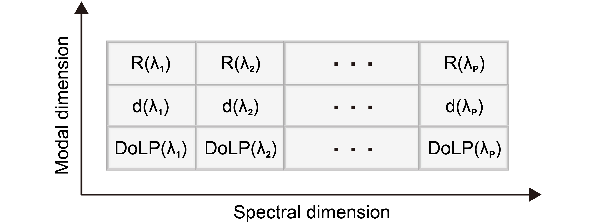
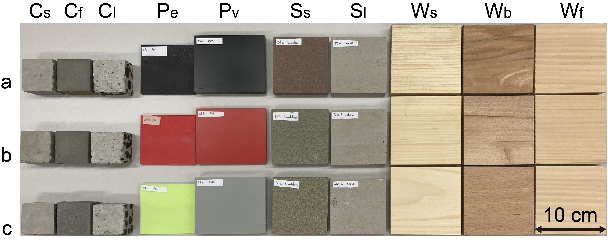

# Dataset of the multimodal multispectral features collected from 30 material samples in 4 material classes

## Files
### WL.csv
Central wavelengths at 28 spectral channels (SCs) with the unit of nm.
### R.csv
600 reflectance spectra measured at 28 spectral channels on the 30 material specimens (20 measurements per material specimen at different surface positions).
### d.csv
600 distance spectra measured at 28 spectral channels on the 30 material specimens (20 measurements per material specimen at different surface positions).
### DoLP.csv
600 degree of linear polarization spectra measured at 28 spectral channels on the 30 material specimens (20 measurements per material specimen at different surface positions).

Figure: Data structure of the MM feature for each measurement with the variable P=28.

## Labels
### Material class
**1** : Concrete (C)  
**2** : Plastic (P)   
**3** : Stone (S)   
**4** : Wood (W)   
### Material subclass
**11** : Standard concrete (Cs)   
**12** : PVA-fiber concrete (Cf)  
**13** : Liapor-insulating concrete (Cl)  
**21** : PE (Pe)    
**23** : PVC (Pv)   
**31** : Sandstone (Ss)   
**32** : Limestone (Ls)    
**41** : Spruce (Ws)   
**42** : Beech (Wb)   
**43** : Fir (Wf)  
### Material specimens
**XXa** : Specimen **a** for the material subclass **XX**  
**XXb** : Specimen **b** for the material subclass **XX**   
**XXv** : Specimen **c** for the material subclass **XX** 

Figure: 30 material specimens.