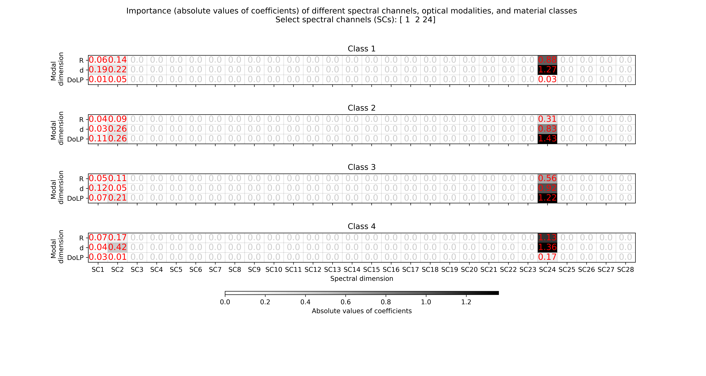
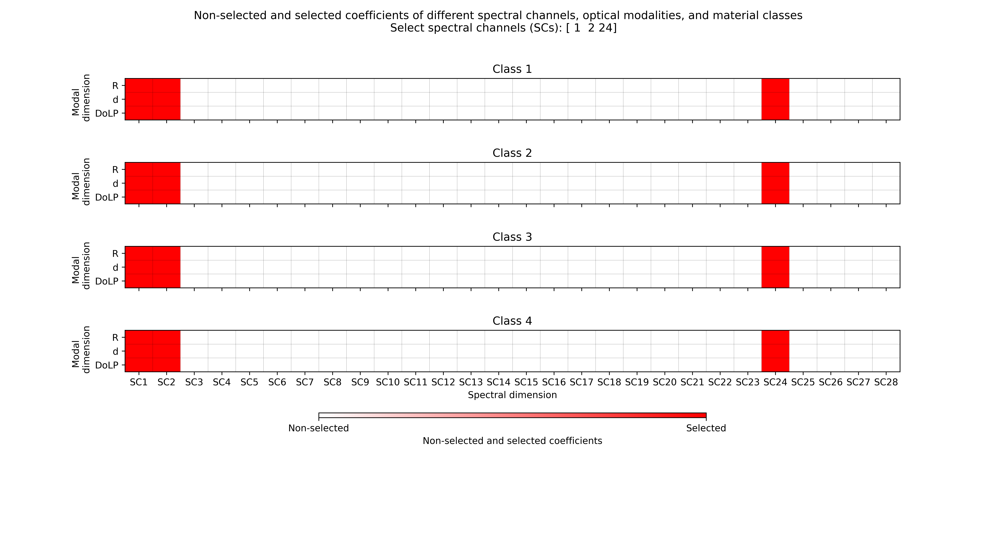

# MGSVM FS 
Multiclass group feature selection algorithm based on an all-in-one support vector machine

**Function**: 

Tackle the group feature selection problem for multicalss classification tasks.

**Characteristics**: 
* Embedded feature selection
* Group feature selection / Group LASSO for structured data / Structural sparsity
* Multiclass classification / All-in-one SVM

## Usage
1. Input your own dataset **(X,y)**
2. Set the target number of feature groups that you want select **Nr_FG_target**
3. Adjust the searching vector **C_vec** for the trade-off penalty parameter **C** to improve the efficiency, if necessary
4. Implement the following command

        python Example_MGSVM_FS.py

## Example results
### Input dataset
The MM features of four material classes for the modality combination R+d+DoLP with labels of material class. 

### Target to select three spectral channels (feature groups)
Nr_WL_target = 3     
Nr_FG_target = Nr_WL_target
### The map of absolute values foa all ceofficients corresponding to different features

Absolute values of the coefficients represent the importance of spectral channels, modalities, material classes.

### The selected spectral channels accroding to the threshold 0.001 of absolute coefficient values

