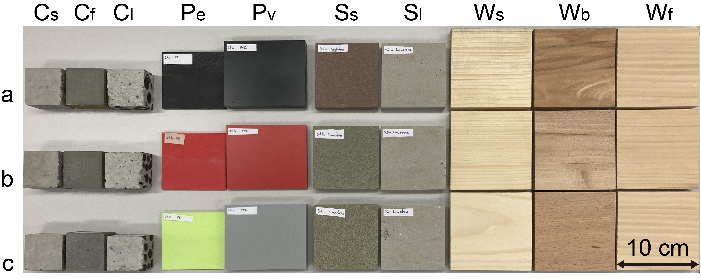

# A feature selection method for multimodal multispectral sensing
<!-- #### Project description  -->
This repository is related to the paper "A feature selection method for multimodal multispectral sensing", which includes:

1.  The dataset collected from 30 material specimens in 4 material classes by using our multimodal multispectral (MM) LiDAR prototype
2. The proposed multiclass group feature selection algorithm based on an all-in-one support vector machine (MGSVM FS)
3. The 10-fold cross-validation as the evaluation framework and three evaluation metrics (i.e., F1 score, stability index, and selection probability) for decision-making
4. The ablation study comparing MGSVM FS with three other feature selection algorithms (i.e., random FS, RF-MDPA FS, and MRMR FS)

## * Environment setup
The list of required packages:
        
        cvxpy==1.4.3 
        matplotlib==3.6.2
        mrmr-selection==0.2.8
        pandas==2.0.3
        scikit-learn==1.1.3
        scipy==1.9.3
        seaborn==0.12.2
        numpy==1.23.3
## 1. MM feature dataset
Dataset of the MM features collected from the material collection can be found in the folder *Dataset_MM_features*.

To plot the MM features (as shown in Fig. 7 of the paper), please implement the following commond.

        python MM_features_plotting.py
        
<!-- 
Figure: 30 material specimens --> 

## 2. Feature selection algorithm: MGSVM FS
Multiclass group feature selection algorithm based on an all-in-one support vector machine
* Embedded feature selection
* Group feature selection / Group LASSO for structured data / Structural sparsity
* Multiclass classification / All-in-one SVM
### Example command -- Plot the selected features output from MGSVM FS
Please refer to the subfolder *FS_algorithm\MGSVM FS*.

## 3. Evaluation framework and metrics
The evaluation framework
        
        10-fold cross-validation

Three evaluation metrics

        1. F1 score
        2. Kuncheva's stability index
        3. Selection probability

Options of modality combinations

        1. DoLP
        2. R
        3. d
        4. R+d
        5. R+DoLP
        6. d+DoLP
        7. R+d+DoLP
        
        R: Reflectance
        d: Distance
        DoLP: Degree of linear polarization

 Target number of selected spectral channels (feature groups)
        
         1 --> 28 
### Example command -- Evaluate the feature selection algorithms for arbitrary modality combinations and save the evaluation metrics
Different modality combinations can be set in the file *Evaluation_feature_selection_methods.py*.

The corresponding evaluation metrics can be output by implementing the following command to run the evaluation framework.

        python Evaluation_feature_selection_methods.py

## 4. Ablation study
Four feature selection algorithms

        1. Random feature selection 
        2. RF-MDPA feature selection
        3. MRMR feature selection
        4. MGSVM feature selection

### Example command -- Plot the final evaluation metrics 
All evaluation metrics for all modality combinations can be found in the subfolder *Results_evaluation_metrics*.

To plot the evaluation metrics (as shown in the Figs. 8-10 of the paper), please implement the following commond.

        python Evaluation_metrics_plotting.py
    

## * Citation

If you find our dataset and/or code useful, we appreciate your consideration in citing our publication.

